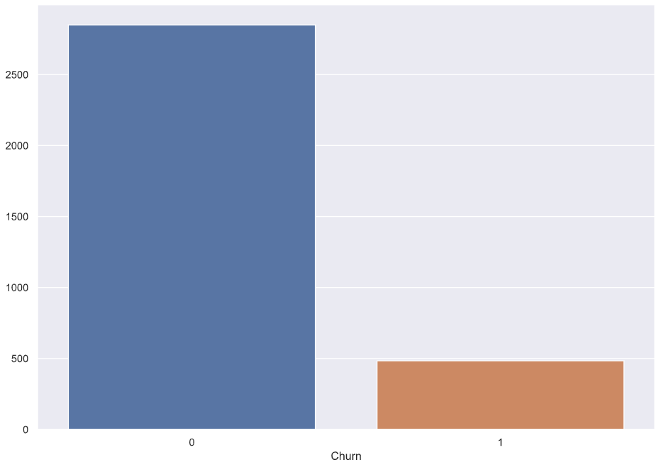
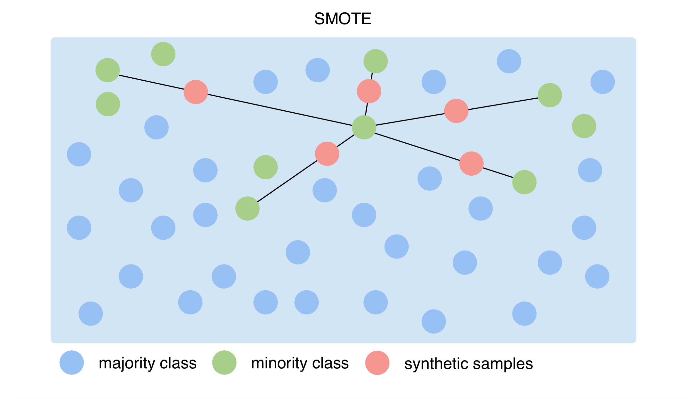
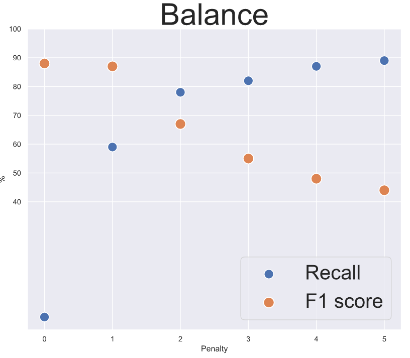

# SyriaTel-Customer-Retention
## The Goal
SyriaTel, a communications company, wants to identify customers who leave their services. It is my intent to create a model to predict these customers in order to identify possible changes to be made to prevent these losses before they occur.
## The Obstacle
The provided dataset consists of 3,333 entries, only 483 or 14.4% of which left the service. We have to work with an imbalanced dataset to create accurate results, avoiding the trap of creating a model heavily biased toward the majority result.

## Conquering the Obstacle
In order to create a successful model, first we have to define what success we're looking for. In an imbalanced dataset like SyriaTel's where we are identifying a large minority variable, our model should be focusing on recall, or to maximize its ability to identify a high percentage of the minority variable as compared to the total amount of that variable. A model meant to predict overall accuracy would focus on identifying the majority variable, which would not be helpful for the intent of the project.
I decided to SMOTE the data, creating artificial data objects that are similar in structure to data with the 'churn,' or turnover, variable. This creates a balanced dataset we can compare evenly, in this case 2,118 data points for both churn and not. Analyzing the results of this process will tell us if this technique is successful.

## Choosing a model

I analyze each model in its base form for its recall and come to the conclusion XGBoost is the most effective. After several iterations, we find our best model. The only parameter left is to tweak is to determine its penalty. As we see, raising the penalty associated with XGBoost increases the model's recall at the cost of overall accuracy. I've highlighted what I believe to be the two best options. My intent here is to treat this model like a real world business conversation. In this scenario, I would present these two options to the company. We would discuss priorities and associated costs and come to a conclusion together.
## Conclusion
I successfully created a model with a recall over 80%. The next steps of this business plan is to narrow the model to find the important factors that influence the customer's decision to leave, and propose ways we can change.